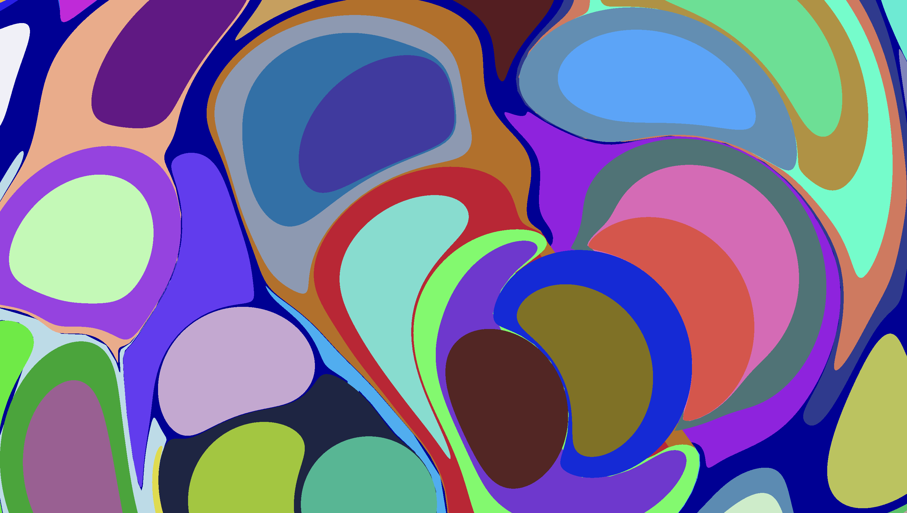

# webgpu_marbling

An implementation of Marbling implemented with WebGPU.

Inspired by:
* [Coding Train](https://www.youtube.com/watch?v=p7IGZTjC008)
* [Amanda Ghassaei](https://blog.amandaghassaei.com/2022/10/25/digital-marbling/)
* [Aubrey Jaffer](https://people.csail.mit.edu/jaffer/Marbling/)

Just a fun toy to learn some WebGPU fundamentals.  Probably the coolest thing from a tech standpoint is the earcut algorithm implemnented with compute shaders.  Also, this only requires one draw call per frame!  (Unless we are loading images!)

Also fun, it's easy to figure out texture coordinates within each drop, so I decided to remix [Jason's Bumble Project](https://bumble.0x88.net).  Check it out!

